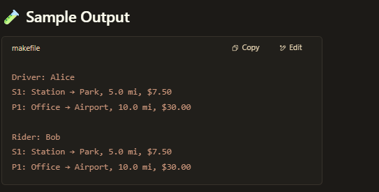

🚗 Ride Management System (Java)
This is a simple object-oriented Ride Management System implemented in Java. It simulates standard and premium rides assigned to drivers and booked by riders. The system demonstrates core OOP concepts like abstraction, inheritance, and polymorphism.

📁 Folder Structure
css
Copy
Edit
src/
└── main/
    └── java/
        └── com/
            └── rideapp/
                ├── Ride.java
                ├── Standard.java
                ├── Premium.java
                ├── Driver.java
                ├── Rider.java
                └── Main.java

🚀 How to Run
Compile:
    javac com/rideapp/main.java

Run:
java com.rideapp.Main.java

✅ Features

=> Abstract Ride class with common ride information.

=> Standard and Premium rides with different fare rates.

=> Driver manages multiple rides.

=> Rider maintains ride history.

=> Polymorphic show() method displays ride info.

🛠️ To Do
 Add unit tests using JUnit

 Accept ride inputs from console or files (CSV/JSON)

 Calculate fare summaries

 Support filtering (e.g., by type or distance)

 (Optional) Convert to GUI or web version

📄 License
This project is for educational purposes. Feel free to use and modify it.

